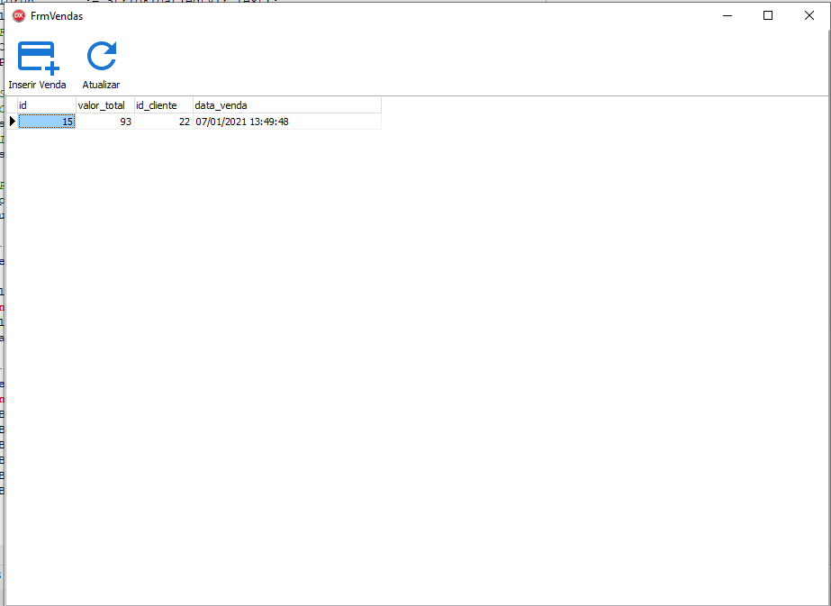

# SistemaDeVendas
Sistema de vendas simplificado feito em Delphi 10.2 Tokyo

Exercicio de conhecimento, periodo de 2 dias para ser executado.
Existem diversas melhorias a serem efetuadas mas fiz o possivel dentro do prazo.

Algumas imagens do programa.

